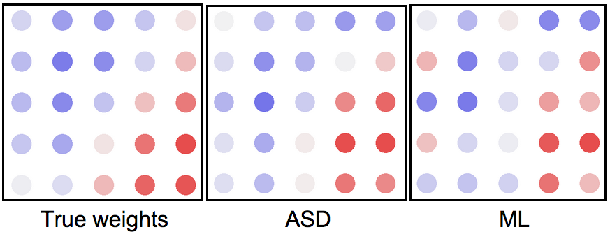

# ASD

__Source__: _Evidence Optimization Techniques for Estimating Stimulus-Response Functions_ [(Sahani, Linden; 2002)](http://papers.nips.cc/paper/2294-evidence-optimization-techniques-for-estimating-stimulus-response-functions)

ASD is a method for estimating the space-time weights/kernel in a Bayesian regression framework where the values of the weights are expected to vary smoothly in space or in time (or both). There are two contexts:

* linear regression (Gaussian or Poisson likelihood)
* logistic regression (Bernoulli likelihood)

n.b. The Gaussian likelihood has a closed-form solution while the others do not.

### Example

In linear regression, we assume that our measurements (Y) are the output of a linear model (Y = X*w + noise), and we want to estimate w. In the example below, the true weights (w) vary smoothly in 2d space (red = negative weights, blue = positive weights). ASD infers the amount of smoothness in X and Y using evidence optimization, allowing its estimate of w to recover the spatial regularities of the true weights. The maximum likelihood (ML) estimate, on the other hand, fails to capture this smoothness. ASD's prior assumptions decrease its sensitivity to noise, and it tends to outperform ML in cross-validation.



### Hyperparameters

The ASD prior requires setting three or so hyperparameters determining the shrinkage, noise variance (Gaussian likelihood only), and smoothing (e.g., in space and/or in time). The best hyperparameters in logistic regression are chosen by gridding the hyperparameter search space and then picking the hyperparameter that minimizes the prediction error on test data. For linear regression, we can choose the hyperparameters that maximize the log-evidence (the log-posterior with the weights marginalized out.)

## Usage

The fitting framework is in `+reg` and can be used to fit models with ASD, ML, and flat weights for comparison.

First, you need to create a score object to specify what your goodness-of-fit test is. (The second argument passed is optional.)

Linear regression:
```
scoreObj = reg.getScoreObj(true, 'rsq');
```

Logistic regression:
```
scoreObj = reg.getScoreObj(false, 'pctCorrect');
```

Now, you need to create a fitting object. Three options are shown below:
```
obj = reg.getObj_ASD(X, Y, D, scoreObj);
obj = reg.getObj_ML(X, Y);
obj = reg.getObj_Flat(X, Y);
```

ASD requires setting hyperparameters. For linear regression, ASD will use evidence optimization (assuming a gaussian likelihood), while for logistic regression it will use one level of grid search.

Now, fit and score.
```
obj = reg.fitAndScore(X, Y, obj, scoreObj);
```

## Testing framework

Running tests:

```
>> runtests('tests/testLinear.m')
>> runtests('tests/testLogistic.m')
```

Updating tests:

```
>> cd tests
>> updateDataLinear
>> updateDataLogistic
```
